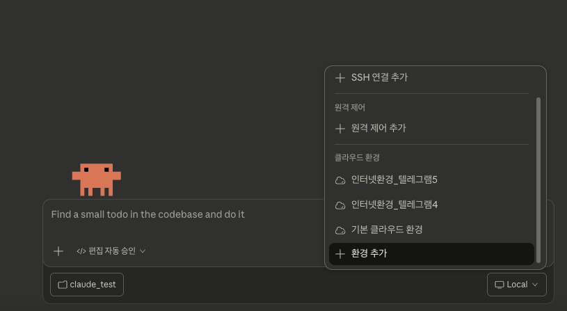
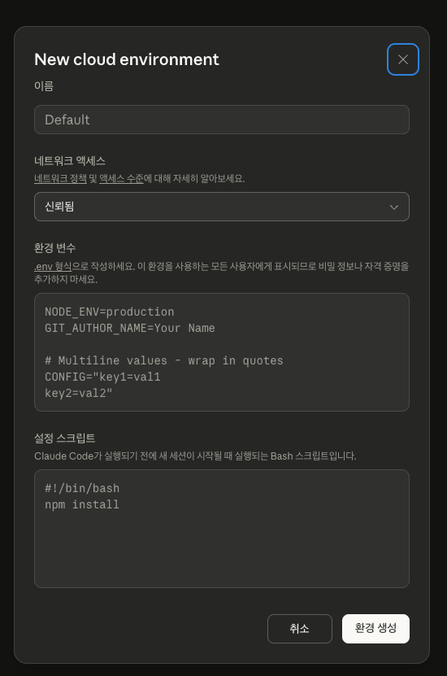
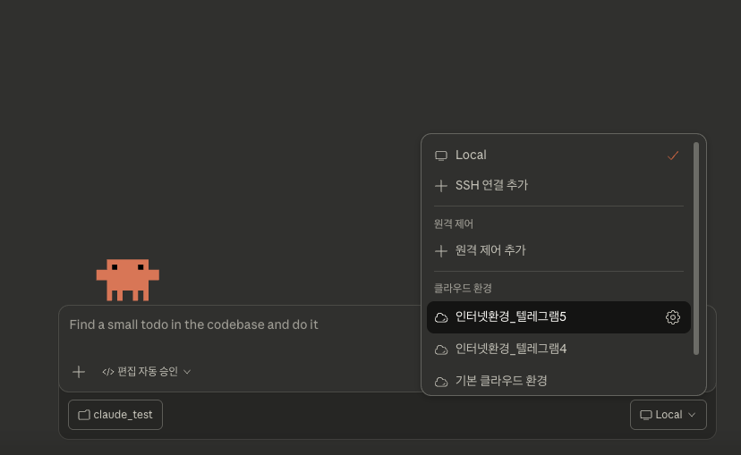

# 클로드 앱에서 텔레그램 알림 수신 가이드

### 목적
- 클로드 앱(데스크탑 버전, 모바일 버전) 을 사용할 때, 클로드가 작업을 마치면 텔레그램 메세지를 수신하도록 한다

### 1. 클로드 클라우드 환경 추가

- 클로드 코드 데스크탑 앱 실행
- 코드 색션
- 새로운 채팅
- 하단에 환경 추가 버튼 클릭





아래 내용을 참고해서 입력하고 `환경 생성` 버튼을 눌러서 클로드 클라우드 환경을 생성한다

이름: 아무거나 입력

네트워크 액세스: 전체(혹은 텔레그램 api 서버 권한 부여)

환경변수: 
```
TELEGRAM_BOT_TOKEN=773xxxxxx (사용할 토큰 입력)
TELEGRAM_CHAT_ID=123123xxxxx (채팅방 id 입력)
CLUADE_CLOUD_NAME=MY_CLUADE_CLOUD (채팅방에 표시될 이름 입력)
```

설정 스크립트: 
```
#!/bin/bash

GITHUB_RAW="https://raw.githubusercontent.com/danielk0121/llm-tips/master"

# 1. hooks 디렉토리 생성
mkdir -p /root/.claude/hooks

# 2. 텔레그램 알림 스크립트 다운로드
curl -fsSL "$GITHUB_RAW/scripts/telegram-hook/noti-telegram-for-claude.sh" \
    -o /root/.claude/hooks/noti-telegram-for-claude.sh
chmod +x /root/.claude/hooks/noti-telegram-for-claude.sh

# 3. settings.json 등록
cat > /root/.claude/settings.json << 'EOF'
{
    "$schema": "https://json.schemastore.org/claude-code-settings.json",
    "hooks": {
        "Stop": [
            {
                "matcher": "",
                "hooks": [
                    {
                        "type": "command",
                        "command": "~/.claude/stop-hook-git-check.sh"
                    },
                    {
                        "type": "command",
                        "command": "/root/.claude/hooks/noti-telegram-for-claude.sh"
                    }
                ]
            }
        ]
    },
    "permissions": {
        "allow": ["Skill"]
    }
}
EOF
```

### 2. 클로드 클라우드 환경 정상 확인



- 새로운 채팅
- 클로드 클라우드 환경을 Local 이 아니라 아까 생성한 클라우드 환경을 사용하도록 변경한다
- 클로드 클라우드 환경 내부 로컬 설정이 잘되어 있는지 /root/.claude 폴더 내용 확인
  - 채팅 세션 시작하자마자 /root 하위 파일 내용 보여달라고 하니까, 이상하게, 에러가 발생함
  - "프로젝트 구조를 보여줘." 처럼 아무 질문이나 먼저하고, /root/.claude 폴더 내용을 확인해야함.
```
프로잭트 구조를 보여줘.
그리고 파일 몇개와 폴더 구조를 볼꺼야.
/root/.claude 폴더 내용을 보여줘.
/root/.claude/settings.json 파일 내용도 보여줘.
/root/.claude/hooks/noti-telegram-for-claude.sh 파일 내용 전체를 보여줘.
```

### 3. 트러블 슈팅

- 혹시 /root/.claude 하위에 settings.json 이나 noti-telegram-for-claude.sh 파일 생성이 문제가 있으면,
  - 클라우드 환경을 다시 만들어야 한다.
  - 클라우드 환경 생성 > 새로운 채팅 > 파일 정상 생성 확인 > 새로운 채팅 > 텔레그램 메세지 수신 확인


