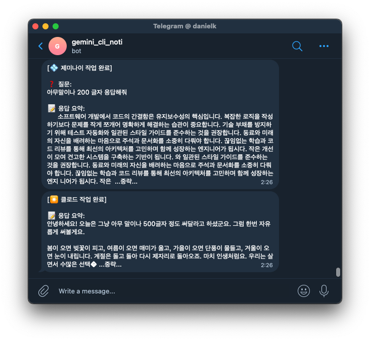

## 가이드
제미나이나 클로드 코드의 hooks 기능을 활용하여 작업 완료 시 텔레그램으로 알림을 받을 수 있습니다.

### 스크린샷


### 텔레그램 봇 설정
- Telegram Bot 생성 및 토큰, 채팅방 id 획득
1. Telegram에서 `@BotFather` 검색 후 `/newbot` 명령으로 봇 생성
2. 발급받은 **Bot Token**(`123456:ABC-DEF...` 형식) 확인
3. 본인 채팅방의 Chat ID 확인 (`@userinfobot` 또는 getUpdates API로 확인)

### Gemini CLI hook 등록
1. `~/.gemini/hooks/` 경로에 스크립트를 복사합니다.
2. 스크립트 내의 `TELEGRAM_BOT_TOKEN`과 `TELEGRAM_CHAT_ID`를 본인의 정보로 수정합니다.
3. 실행 권한을 부여합니다: `chmod +x ~/.gemini/hooks/noti-telegram-for-gemini.sh`
4. hook 등록을 합니다. `~/.gemini/settings.json`
```json
{
  "hooks": {
    "AfterAgent": [
      {
        "matcher": "*",
        "hooks": [
          {
            "name": "notify-user-after-turn",
            "type": "command",
            "command": "~/.gemini/hooks/noti-telegram-for-gemini.sh",
            "description": "제미나이 작업 완료 후 텔레그램 알림 전송"
          }
        ]
      }
    ]
  }  
}
```

### Claude Code Hook 등록
1. `~/.claude/hooks/` 경로에 스크립트를 복사합니다.
2. 스크립트 내의 `TELEGRAM_BOT_TOKEN`과 `TELEGRAM_CHAT_ID`를 본인의 정보로 수정합니다.
3. 실행 권한을 부여합니다: `chmod +x ~/.claude/hooks/noti-telegram-for-claude.sh`
4. hook 등록을 합니다. `~/.claude/settings.json`
  - `~/.claude/settings.json` 파일에 아래 내용을 추가하여 `Stop` 이벤트를 등록합니다.   
  - `Stop` 이벤트는 Claude가 응답을 완전히 마쳤을 때 트리거되므로 알림 용도에 가장 적합합니다.
```json
{
  "hooks": {
    "Stop": [
      {
        "hooks": [
          {
            "type": "command",
            "command": "~/.claude/hooks/noti-telegram-for-claude.sh"
          }
        ]
      }
    ]
  }
}
```

### 참고
- `command` 경로에 스크립트의 **상대경로** 사용.
- `command` 경로에 ~/.claude 폴더 아닌 파일 사용시 **절대경로** 사용.

